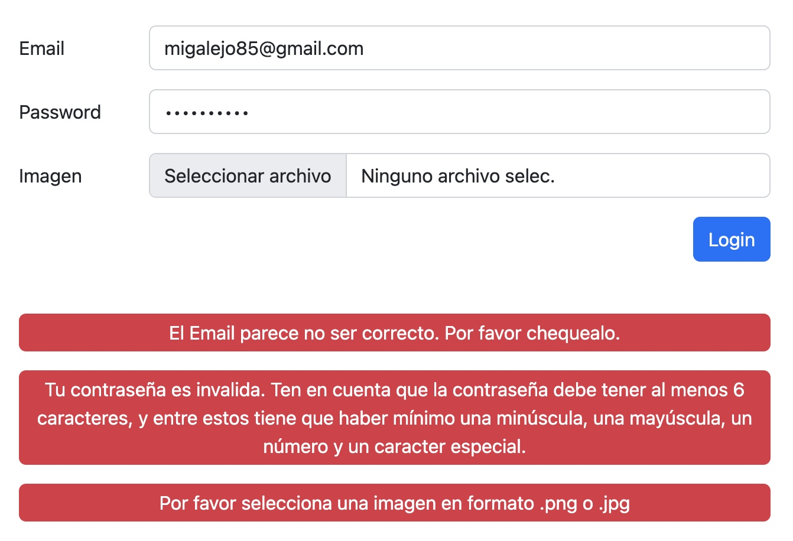

Hola Manuel,

### __Sobre la Actividad 12 y el feedback de las lecciones anteriores:__
*No sabia que esta actividad iba a ser sobre session y por eso me adelante en las actividades anteriores, sin embargo he intentado corregir y mejorar el codigo en base al feedback que me has dado.*

---

#### __Password Complexity__
He decidido usar esta regex porque me parece bastante completa.
> "/^(?=.*[a-z])(?=.*[A-Z])(?=.*\d)(?=.*[@$!%*?&])[A-Za-z\d@$!%*?&]{6,}$/"

con esta regex el usuario tiene que proporcionar una contraseña que contenga minimo una minuscula, una mayuscula, un numero y un simbolo expecial. Ademas debe contener al menos 6 caracteres. Se que es mas lioso para ponerlo pero pense que por buena practica me voy acostumbrando a hacerlo asi. 
Para simplificar el testeo, he puesto en el campo de password ya uno por defecto:
> Password1!

---
#### __Mensajes de Error en el Login__
en el archivo ValidateLogin.php he complementado el codigo necesario para presentar al usuario mensajes de error si no cumple los requisitos para ello. Por ejemplo si el email, la contrasena o la imagen no cumplen el formato requerido. Disculpas por no ponerlo antes, entiendo que sin esto debe de haber sido mas dificil como usuario entender porque la contrasena no funciona.

---
#### __Nested Ifs en Validation__
Si, la verdad me lie mucho con eso y me costo un poco hacerlo mas leible. Al final intenté hacerlo como lo explicaste en clase. Espero que haya quedado mejor ahora.

---
#### __No guardar imagen si el login no es successful__
Ahora la imagen solo se guarda si las validaciones son todas bien.

---
#### __LogOut__
Al final lo cambie un poco pero igual creo que no cambio mucho... Ahora al darle click a logout, te llevo a una pagina logout, donde se realiza lo necesario para hacer logout y te redirige a la pagina de inicio para que puedas hacer login... tendria que probar lo que me dijiste.

---
#### __Session Management__
Finalmente he lidiado un poco con el tema de mantener session si el usuario regresa, pero me parece que lo he conseguido.

---
#### __Conclusion__
Bueno, espero a ver que feedback me das en esta actividad.
Debo decir que la clase de PHP me ha gustado. Le tenia un poco de negativa al tema PHP pero las actividades estaban buenas y me he podido concentras mas en la logica y no tanto en el maqueteo -> Highly Appreciated. Gracias.

