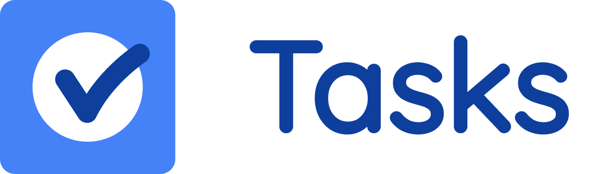

<p align="center" >
<a href="https://github.com/Migalejo-at-EIP/Tasks-TFM"></a>
</p>


```
Master en Desarrollo Web Fullstack IV - Miguel A. Correa Avila
```
# Proyecto: Trabajo Final del Máster

Este proyecto ha sido creado como Trabajo final del Máster en Desarrollo Web Fullstack IV de la Escuela Internacional de Posgrados (EIP) con el fin de demostrar los conocimientos adquiridos durante el programa.

Este proyecto es una aplicación sencilla de tareas, donde los usuarios se pueden registrar, crear listas de tareas y agregar tareas a estas listas. Adicionalmente, las listas de tareas se pueden compartir con otros usuarios registrados.

### Instalación

Dado que este es un proyecto puramente educacional, no se tiene planeado hacer un despliegue a producción.

### Requerimientos
- Tener Docker instalado.
- Tener acceso a una terminal.

# Instrucciones

## Primera vez iniciando el proyecto:
La primera vez que se inicia el proyecto es necesario iniciar los contenedores y ejecutar las migraciones de laravel para crear los datos necesarios en la base de datos
Para esto: Clonar el repositorio y, desde la raíz del proyecto con la terminal, ejecutar los siguientes comandos:


```sh
$ docker-compose up -d
```
una vez finalizado ejecutamos un script que he creado para iniciar las migraciones y poblar la base de datos asi como iniciar el servidor

```sh
$ docker exec -it TFM-EIP-Miguel-TasksApp init-project.sh
```
Finalmente se lanzara la app la cual sera accesible desde:

- http://localhost:8000

## Iniciar el proyecto despues de la primer vez
ejecutar el comando:
```sh
$ docker-compose up -d
```
y lanzar el servidor
```sh
docker exec -it TFM-EIP-Miguel-TasksApp php artisan serve
```

# Tecnologias usadas en este proyecto:
- Laravel
- php
- html
- css / sass
- JavaScript
- Bootstrap
- Livewire
- MySQL
- Node Package Manager (npm)
- Docker

## Detalles de la App
Para la authenticacion de usuarios he usado el middleware de Auth que proporciona Laravel con Laravel/ui y Auth.

Con el fin de garantizar una experiencia de uso moderna he optado por usar Livewire y asi general una especie de SPA por lo que no he usado endpoints para general listas o tareas. Los componentes de Livewire se actualizan con los cambios de estado de la App proporcionando asi un comportamiento como en una SPA: 

//
Livewire is a full-stack framework for Laravel that makes building dynamic interfaces simple, without leaving the comfort of Laravel.
//

Las listas, tareas, usuarios y relaciones de datos, se almacenan todas en una base de datos de MySQL creadas con las migraciones de Laravel. 

Para asegurar que las funciones basicas de los modelos y la conexion a la BD funciona correctamente he usado test unitarios con laravel. 

para ejecutar los tests: con los contenedores corriendo ejecutar el siguiente comando:

```sh
$ docker exec -it TFM-EIP-Miguel-TasksApp php artisan test
```

## Datos de prueba

al lanzar la app sera neceario hacer login con un usuario registrado o registrar un usuario nuevo. 

Para simplificar el testeo de la App la BD ya contiene datos de prueba por lo que se puede hacer login usando los siguientes usuarios:

user: mario@example.com
password: 12345678

user: peach@example.com
password: 12345678

user: luigi@example.com
password: 12345678

## Version Control

Para este proyecto se ha creado un repositorio en Github
https://github.com/Migalejo-at-EIP/Tasks-TFM

